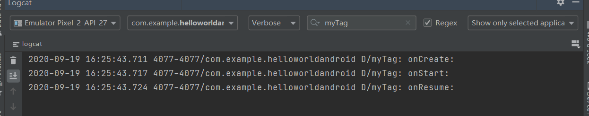
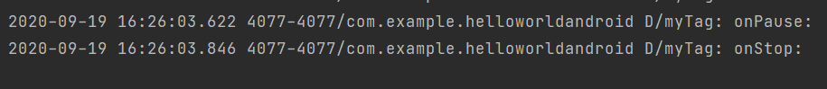
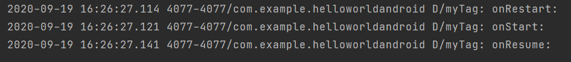
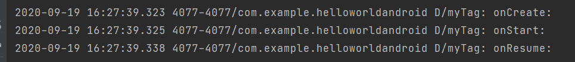

# 安卓生命周期

一、基本作用

Activity的生命周期共七个指示器：onCreate、onStart、onResume、onPause、onStop、onDestroy、onRestart。

如下图所示。

（1）onCreate() ，不可见状态
 在Activity被创建时回调，第一个生命周期。我们一般在创建Activity时需要重写该方法做一些初始化的操作，如通过setContentView设置界面布局的资源，初始化所需要的组件信息等。

（2）onStart() ，可见状态
 该方法回调表示Activity正在启动，此时Activity处于可见状态，只是还没有在前台显示，因此用户也无法交互。可以简单理解为Activity已显示却无法被用户看见。

（3）onResume() ，可见状态
 此方法回调时，Activity已在在屏幕上显示UI并允许用户操作了。从流程图可见，当Activity停止后（onPause、onStop方法被调用），重新回到前台时也会调用onResume方法。可以在onResume方法中初始化一些资源，比如打开相机或开启动画。

（4）onPause() ，可见状态
 此方法回调时，Activity正在停止（Paused形态），通常接下来 onStop() 会被回调 。但通过流程图可见，另一种情况是onPause() 执行后直接执行了onResume方法，这可能是用户点击Home键，让程序退回到主界面，程序在后台运行时又迅速地再回到到当前的Activity，此时onResume方法就会被回调。我们可以在onPause方法中做一些数据存储、动画停止、资源回收等操作。另外，onPause方法执行完成后，新Activity的onResume方法才会被执行。所以onPause不能太耗时，因为这可能会影响到新的Activity的显示。

（5）onStop() ，不可见状态
 此方法回调时，Activity即将停止或者完全被覆盖（Stopped形态），此时Activity不可见，仅在后台运行。同样地，在onStop方法可以做一些资源释放的操作，不能太耗时。

（5） onRestart(），可见状态
 此方法回调时，表示Activity正在重新启动，由不可见状态变为可见状态。这种情况，一般发生在用户打开了一个新的Activity时，之前的Activity就会被onStop，接着又回到之前Activity页面时，之前的Activity的 onRestart方法就会被回调。

（6）onDestroy() ，不可见状态
 此方法回调时，表示Activity正在被销毁，也是生命周期最后一个执行的方法，一般我们可以在此方法中做一些回收工作和最终的资源释放。

> **默认设置情况下**
>
> 安卓手机的**Back键调用onDestroy()**  被销毁了，后台不在运行
>
> **Home键调用onStop()**  变为不可见，但是后台还在运行

* **手机打开App**

* **手机按下Home键**

* **再次点开应用**

* **手机按下Back键**

* **手机再次点开应用**

