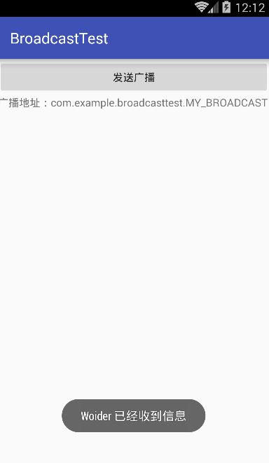
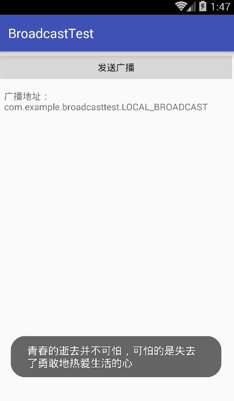

# 详解广播机制

## 广播机制的简介

在一个IP网络范围中,最大的ip地址是被保留用作广播地址来使用的,比如某个IP范围是192.168.0.xxx,子网掩码是255.255.255.0,那么这个网络的广播地址就是192.168.0.255.广播数据包会被发送到同一个网络上的所有端口,这样在该网络中的每台主机都会接收到这条广播.

android中的广播主要可以分为：

1）标准广播
一种异步执行的广播，在广播发出之后，所有的广播接收器几乎都会在同一时刻接收到这条广播信息，因此它们之间没有任何先后顺序可言。这种广播的效率会比较高，但同时也意味着它是无法被截断的。

2）有序广播
是一种同步执行的广播，在广播发出之后，同一时刻只会有一个广播接收器能够收到这条广播消息，当这个广播接收器中的逻辑执行完毕之后，广播才会继续传递，所以此时的广播接收器是有先后顺序的，优先级高的广播接收器就可以先收到广播信息，并且前面的广播接收器还可以截断正在传递的广播。


------


## 接收系统广播

Android内置了很多系统级别的广播，可以在应用程序中通过监听这些广播来得到各种系统的状态信息。

手机开机完成后会发出一条广播，电池的电量发生变化会发出一条广播，时间改变也会发出一条广播……如果想要接受到这些广播，就需要使用广播接收器。

广播接收器可以自由地对自己感兴趣的广播进行注册，当有相应的广播发出时，广播接收器就能够收到该广播，并在内部处理相对应的逻辑。

**注册广播的方式一般有两种，在代码中注册和在 AndroidManifest.xml 中注册**，前者被称为动态注册，后者被称为静态注册。

创建广播接收器只需要新建一个类，让它**继承自BroadcastReceiver，并重写父类的onReceiver()方法**。当有消息通过广播传递过来时，onReceive()方法就会得到执行。


### 动态注册监听网络变化

```java
public class MainActivity extends AppCompatActivity {
    private IntentFilter intentFilter;
    private NetworkChangeReceiver networkChangeReceiver;


    @Override
    protected void onCreate(Bundle savedInstanceState) {
        super.onCreate(savedInstanceState);
        setContentView(R.layout.activity_main);


        intentFilter = new IntentFilter();
        //为过滤器添加处理规则
        intentFilter.addAction("android.net.conn.CONNECTIVITY_CHANGE");
        networkChangeReceiver = new NetworkChangeReceiver();
        //注册广播接收器
        registerReceiver(networkChangeReceiver, intentFilter);
    }

    @Override
    protected void onDestroy() {
        super.onDestroy();
        //动态的广播接收器最后一定要取消注册
        unregisterReceiver(networkChangeReceiver);
    }

    //自定义内部类，继承自BroadcastReceiver
    public class NetworkChangeReceiver extends BroadcastReceiver {

        @Override
        public void onReceive(Context context, Intent intent) {
            //实现onReceive()方法的逻辑
            Toast.makeText(context, "网络状态改变", Toast.LENGTH_SHORT).show();
        }
    }
}
```

> IntentFilter 的 addAction() 方法中添加了一个值为android.net.conn.CONNECTIVITY_CHANGE 的 action，用于接收系统对网络状态改变而发出的一条广播。（广播接收器想要监听什么广播，就在这里添加相应的action）
>
> 调用 registerReceiver() 方法对广播接收器进行注册，将 BroadcastReceiver 和 IntentFilter 的实例传递进去即可。
>
> 最后要记得，动态注册的广播接收器一定都要取消注册才行。通过调用 unregisterReceiver() 方法取消注册。

修改 NetworkChangeReceiver 的 onReceiver() 方法，使之能够准确告诉用户当前网络状态：

Android系统规定，如果程序需要访问系统关键信息，必须在配置文件中声明权限才可以，否则程序直接崩溃。

这里查询网络状态需要声明权限，打开AndroidManifest.xml文件，为`<uses-permission>`添加权限（`<application>`之前），代码如下：

```xml
<uses-permission android:name="android.permission.ACCESS_NETWORK_STATE" />
```

修改 NetworkChangeReceiver 中的代码：

```java
public class NetworkChangeReceiver extends BroadcastReceiver {

  @Override
  public void onReceive(Context context, Intent intent) {//connectivityManger是一个系统服务类，专门用于管理网络连接
    ConnectivityManager connectivityManager = (ConnectivityManager) getSystemService(Context.CONNECTIVITY_SERVICE);
    NetworkInfo networkInfo = connectivityManager.getActiveNetworkInfo();
    //调用NetworkInfo的isAvailable()方法判断是否联网
    if(networkInfo != null && networkInfo.isAvailable()){
      Toast.makeText(context,"网络已连接",Toast.LENGTH_SHORT).show();
    }else{
      Toast.makeText(context,"网络不可用",Toast.LENGTH_SHORT).show();
    }
  }
}
```


### 静态注册实现开机启动

动态注册广播接收器可以自由地控制注册与注销，在灵活性方面有很大优势。但是它也存在一个缺点，即必须要在程序启动之后才能接收到广播，因为注册的逻辑是写在onCreate()方法中的。而静态注册可以让程序在未启动的情况下就能接收到广播。

这里我们准备让程序接收一条开机广播，当收到这条广播的时候就可以在onReceive()方法里执行相应的逻辑，从而实现开机启动的功能。

新建一个 BootCompleteReceiver 继承自 BroadcastReceiver，代码如下所示：

```java
public class BootCompleteReceiver extends BroadcastReceiver {

    @Override
    public void onReceive(Context context, Intent intent) {
        Toast.makeText(context,"程序已启动",Toast.LENGTH_SHORT).show();
    }
}
```

这里不再使用内部类的方式来定义广播接收器，因为静态注册需要在 AndroidManifest 中将广播接收器的类名传递进去。

**修改 AndroidManifest.xml 文件，代码如下：**

```xml
<?xml version="1.0" encoding="utf-8"?>
<manifest xmlns:android="http://schemas.android.com/apk/res/android"
    package="com.example.dudon.broadcasttest">

    <uses-permission android:name="android.permission.ACCESS_NETWORK_STATE" />

    <uses-permission android:name="android.permission.RECEIVE_BOOT_COMPLETED" />

    <application
        android:allowBackup="true"
        android:icon="@mipmap/ic_launcher"
        android:label="@string/app_name"
        android:supportsRtl="true"
        android:theme="@style/AppTheme">
        <activity android:name=".MainActivity">
            <intent-filter>
                <action android:name="android.intent.action.MAIN" />

                <category android:name="android.intent.category.LAUNCHER" />
            </intent-filter>
        </activity>

        <receiver android:name=".BootCompleteReceiver">
            <intent-filter>
                <action android:name="android.intent.action.BOOT_COMPLETED" />
            </intent-filter>
        </receiver>
    </application>

</manifest>
```

核心代码：

```xml
<!--声明监听系统开机广播权限-->
<uses-permission android:name="android.permission.RECEIVE_BOOT_COMPLETED" />

<receiver android:name=".BootCompleteReceiver">
  <intent-filter>
    <!--接收广播类型筛选-->
    <action android:name="android.intent.action.BOOT_COMPLETED" />
  </intent-filter>
</receiver>
```

将模拟器关闭并重新启动，在启动完成之后就会收到开机广播了。

注意：不要再 onReceive() 方法中添加过多的逻辑或者进行任何耗时的操作，当onReceive()方法运行了较长时间而没有结束时，程序就会报错。广播接收器更多是扮演打开其他组件的角色，比如创建一条状态栏通知，或者启动一个服务。


------


## 发送自定义广播

### 发送标准广播

发送广播之前的准备工作，定义一个广播接收器来准备接收此广播，并在XML中对这个广播接收器进行注册：

MyBroadcastReceiver 广播接收器：

```java
public class MyBroadcastReceiver extends BroadcastReceiver {

  @Override
  public void onReceive(Context context, Intent intent) {
    Toast.makeText(context,"Woider 已经收到信息",Toast.LENGTH_SHORT).show();
  }
}
```

AndroidManifest.xml 对广播接收器进行注册：

```xml
<receiver android:name=".MyBroadcastReceiver">
<intent-filter>
<action android:name="com.example.broadcasttest.MY_BROADCAST" />
</intent-filter>
</receiver>
```

修改MainActivity 中的 onCreate()方法，如下所示：

```java
@Override
protected void onCreate(Bundle savedInstanceState) {
  super.onCreate(savedInstanceState);
  setContentView(R.layout.activity_main);
  Button button = (Button)findViewById(R.id.button);
  button.setOnClickListener(new View.OnClickListener() {
  	@Override
  	public void onClick(View v) {
  	//把要发送的广播值传入Intent对象
  	Intent intent = new Intent("com.example.broadcasttest.MY_BROADCAST");
  	//调用Context的 sendBroadcast()方法发送广播
  	sendBroadcast(intent);
  }
});
```

首先构建一个Intent对象，并把要发送的广播的值传入，然后调用 Context 的 sendBroadcast()方法将广播发送出去，这样监听 com.example.broadcasttest.MY_BROADCAST这条广播的广播接收器就会收到消息。此时发出去的广播就是一条标准广播。

程序运行截图：



另外，由于广播是使用Intent进行传递的，因此你还可以在Intent中携带一些数据传递给广播接收器。


### 发送有序广播

广播是一种可以跨进程的通信方式。因此在我们应用程序内发出的广播，其他的应用程序也可以收到。

你可以另外新建一个工程，定义一个广播接收器，接收本程序自定义的广播。可以验证得出结论，应用程序发出的广播是可以被其他应用程序接收到的。

不过目前为止，程序发出的都还是标准广播，**如果需要发送有序广播，只需要修改一行代码，即将 sendBroadcast()方法改成 sendOrderedBroadcast()方法**。

sendOrderedBroadcast()方法接收两个参数，第一个参数仍然是 Intent，第二个参数是一个与权限相关的字符串。

有序广播的接收是有先后顺序的，前面的广播接收器还可以将广播截断，阻止其继续传播。

如果要设定广播接收器的先后顺序，可以在注册的时候进行设定，在 AndroidManifest 中**在`<receiver>`的`<intent-filter>`元素中，通过android:priority 属性给广播接收器设置优先级**，数值越大的优先级越高，优先级越高的就可以先收到广播。

如果在 **BroadcastReceiver 的子类方法 onReceiver()中调用了 abortBroadcast()方法**，就表示将这条广播截断，后面的广播接收器将无法再接收到这条广播。

MyBroadcastReceiver.java文件

```java
public class MyBroadcastReceiver extends BroadcastReceiver {
    @Override
    public void onReceive(Context context, Intent intent) {
        Toast.makeText(context, "received in MyBroadcastReceiver", Toast.LENGTH_SHORT).show();
        abortBroadcast();
    }
}
```

MainActivity.java文件

```java
public class MainActivity extends AppCompatActivity {

  
    @Override
    protected void onCreate(Bundle savedInstanceState) {
        super.onCreate(savedInstanceState);
        setContentView(R.layout.activity_main);

        Button button = (Button) findViewById(R.id.btn_send_broadcast);

        button.setOnClickListener(new View.OnClickListener() {
            @Override
            public void onClick(View view) {
                Intent intent = new Intent("com.example.broadcastreceivertest.MyBroadcastReceiver");
                sendOrderedBroadcast(intent,null);
            }
        });

   
    }
}
```


------


## 使用本地广播

系统广播可以被其他任何程序接收到，这样就很容易引起安全性的问题。比如我们发送的一些携带关键性数据的广播有可能被其他的应用程序截获，或者其他的程序不停地向我们的广播接收器里发送各种垃圾广播。

为了能够简单地解决广播安全性问题，Android 引入了一套本地广播机制，使用这个机制发出的广播只能够在应用程序的内部进行传递，并且广播接收器也只能接收来自本应用程序发出的广播，这样所有的安全性问题就都不存在了。

本地广播的用法并不复杂，主要就是使用了一个LocalBroadcastManager 来对广播进行管理，并提供了发送广播和注册广播接收器的方法。

修改 MainActivity 中的代码，具体实现方法如下：

```java
public class MainActivity extends AppCompatActivity {

    private IntentFilter intentFilter;
    private LocalReceiver localReceiver;
    private LocalBroadcastManager localBroadcastManager;

    @Override
    protected void onCreate(Bundle savedInstanceState) {
        super.onCreate(savedInstanceState);
        setContentView(R.layout.activity_main);
        //获取LocalBroadcastManger实例
        localBroadcastManager = localBroadcastManager.getInstance(this);

        TextView textView = (TextView)findViewById(R.id.broadcast);
        textView.setText("广播地址：\ncom.example.broadcasttest.LOCAL_BROADCAST");
        Button button = (Button)findViewById(R.id.button);
        button.setOnClickListener(new View.OnClickListener() {
            @Override
            public void onClick(View v) {
                Intent intent = new Intent("com.example.broadcasttest.LOCAL_BROADCAST");
                intent.putExtra("woider","青春的逝去并不可怕，可怕的是失去了勇敢地热爱生活的心");
                //发送本地广播
                localBroadcastManager.sendBroadcast(intent);
            }
        });
        intentFilter = new IntentFilter();
        intentFilter.addAction("com.example.broadcasttest.LOCAL_BROADCAST");
        localReceiver = new LocalReceiver();
        //注册本地广播监听器
        localBroadcastManager.registerReceiver(localReceiver,intentFilter);


    }

    @Override
    protected void onDestroy() {
        super.onDestroy();
        localBroadcastManager.unregisterReceiver(localReceiver);
    }

    //本地广播接收器
    class LocalReceiver extends BroadcastReceiver{

        @Override
        public void onReceive(Context context, Intent intent) {
            String data = intent.getStringExtra("woider");
            Toast.makeText(context,data,Toast.LENGTH_SHORT).show();
        }
    }
}
```

首先通过**LocalBroadcastManager 的 getInstance() 方法**得到它的一个实例，然后在注册广播接收器的时候调用的是 **LocalBroadcastManager 的 registerReceiver()方法**，在发送广播的时候调用的是 **LocalBroadcastManager 的 sendBroadcast() 方法**，仅此而已。

运行程序，点击“发送广播”，效果如图所示：



可以看到，LocalReceiver成功的收到了这条本地广播，并通过Toast提示了出来。如果你还有兴趣进行实验，可以尝试在其他应用程序中去接收 LOCAL_BROADCAST 这条广播，肯定无法收到，因为这条广播只会在 BroadcastTest 程序内传播

注意：**本地广播是无法通过静态注册的方式来接收的**。

最后盘点一下使用本地广播的几点优势：

1. 可以明确地知道正在发送的广播不会离开我们的程序，因此不需要担心机密数据泄露的问题。

2. 其他的程序无法将广播发送到我们的程序内部，因此不需要担心会有安全漏洞的隐患。

3.　　发送本地广播比起发送系统全局广播将会更加高效。