# 启动模式

在实际的项目中我们应该根据特定的需求为每个活动指定恰当的启动模式。
 启动模式一共有4种。**standard、singleTop、singleTask**和**singleInstance**
 通过在AndroidManifest.xml中给`<activity>`标签指定`android:launchMode`属性来选择启动模式。

## standard

活动的默认启动模式。在该模式下，每当启动一个新活动，它就会在返回栈中入栈，并处于栈顶的位置，并且，不管此活动是否已经存在于返回栈中，每次启动都会创建该活动的一个新实例。

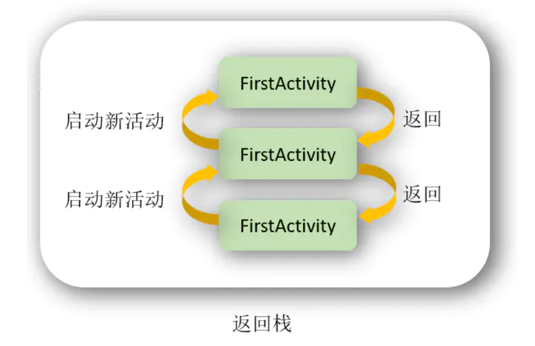

**代码：**

```java
public class MainActivity extends AppCompatActivity {

  @Override
  protected void onCreate(Bundle savedInstanceState) {
    super.onCreate(savedInstanceState);
    Log.d("FirstActivity", this.toString());
    setContentView(R.layout.activity_main);
    Button button = (Button) findViewById(R.id.toMainActivity);
    button.setOnClickListener(view -> {
      Intent intent = new Intent(MainActivity.this, MainActivity.class);
      startActivity(intent);
    });
  }
}
```

在MainActivity中的onCreate()方法中加入`Log.d("FirstActivity",this.toString());`，用于在创建活动实例时打印信息；在按钮点击函数start_secondavtivity()中更改代码实现在MainActivity中打开MainActivity

**UI界面：**

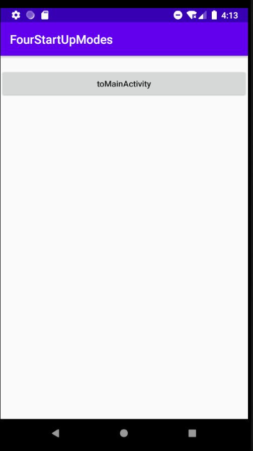

**日志：**

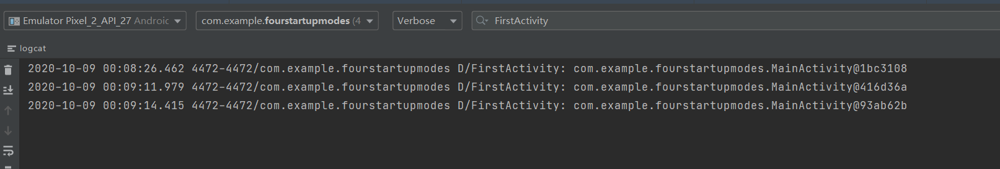

程序初运行会创建一个MainActivity实例，并且每点击一次按钮就会创建一个新的MainActivity实例，从打印信息中我们可以看出存在3个不同的MainActivity，因此需要连按3次back键才能推出程序。


------


## singleTop

在启动活动时如果发现返回栈的栈顶已经是该活动，则认为可以直接使用它，不会再创建新的活动实例。

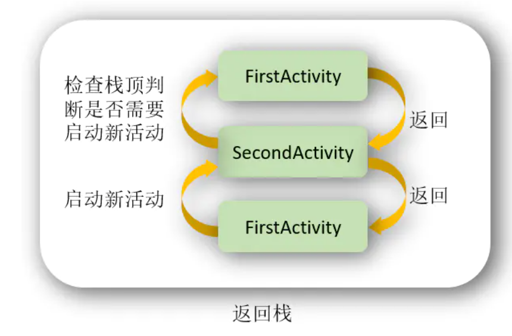

修改`AndroidMainfest.xml`中MainActivity的启动模式`android:launchMode="singleTop"`

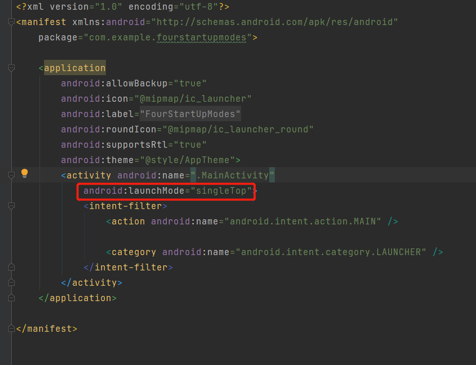

**日志：**

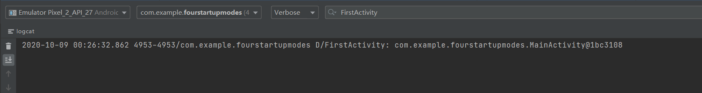

不管点击多少次按钮，都只有一次打印信息，，因为目前MainActivity已经处于返回栈的栈顶，每当想要再启动一个MainActivity时都会直接使用栈顶的活动，因此MainActivity只有一个实例，仅按一次back键就可退出程序。

不过当MainActivity并未处于栈顶时，若再启动MainActivity还是会创建新的实例。


下面来实验一下，修改MainActivity中按钮响应的代码，将按钮跳转改为SecondActivity，SecondActivity跳转MainActivity

**MainActivity：**

```java
public class MainActivity extends AppCompatActivity {

  @Override
  protected void onCreate(Bundle savedInstanceState) {
    super.onCreate(savedInstanceState);
    setContentView(R.layout.activity_main);
    Log.d("FirstActivity", this.toString());
    Button button1 = (Button) findViewById(R.id.button1);
    button1.setOnClickListener(view -> {
      Intent intent = new Intent(MainActivity.this, SecondActivity.class);
      startActivity(intent);
    });
  }
}
```

**SecondActivity：**

```java
public class SecondActivity extends AppCompatActivity {

  @Override
  protected void onCreate(Bundle savedInstanceState) {
    super.onCreate(savedInstanceState);
    setContentView(R.layout.activity_second);
    Log.d("SecondActivity", this.toString());
    Button button2 = (Button) findViewById(R.id.button2);
    button2.setOnClickListener(view -> {
      Intent intent = new Intent(SecondActivity.this, MainActivity.class);
      startActivity(intent);
    });
  }
}
```

**activity_second.xml：**

```xml
<?xml version="1.0" encoding="utf-8"?>
<androidx.constraintlayout.widget.ConstraintLayout xmlns:android="http://schemas.android.com/apk/res/android"
                                                   xmlns:app="http://schemas.android.com/apk/res-auto"
                                                   xmlns:tools="http://schemas.android.com/tools"
                                                   android:layout_width="match_parent"
                                                   android:layout_height="match_parent"
                                                   tools:context=".SecondActivity">

  <Button
          android:id="@+id/button2"
          android:layout_width="0dp"
          android:layout_height="wrap_content"
          android:text="@string/button2"
          app:layout_constraintBottom_toBottomOf="parent"
          app:layout_constraintEnd_toEndOf="parent"
          app:layout_constraintStart_toStartOf="parent"
          app:layout_constraintTop_toTopOf="parent"
          app:layout_constraintVertical_bias="0.050000012" />
</androidx.constraintlayout.widget.ConstraintLayout>
```

**日志：**

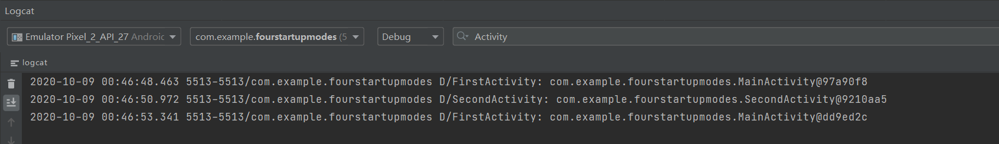

可以看到系统首先创建一个MainActivity实例，我们点击按钮后系统又创建出一个SecondActivity实例，此时栈顶活动变为SecondActivity，再点击SecondActivity中的按钮，系统会创建一个新的MainActivity实例。现在按下返回键会回到SecondActivity，再次按下返回键回到第一个MainActivity，再按一次才退出程序。


------


## singleTask

使用 single Top模式可以很好地解决重复创建栈顶活动的问题，但是如你在上一节所看到的，如果该活动并没有处于栈顶的位置，还是可能会创建多个活动实例的。那么有没有什么办法可以让某个活动在整个应用程序的上下文中只存在一个实例呢?这就要借助 singleTask模式来实现了。当活动的启动模式指定为 singleTask，每次启动该活动时系统首先会在返回栈中检查是否存在该活动的实例，如果发现已经存在则直接使用该实例，并把在这个活动之上的所有活动统统出栈，如果没有发现就会创建一个新的活动实例。

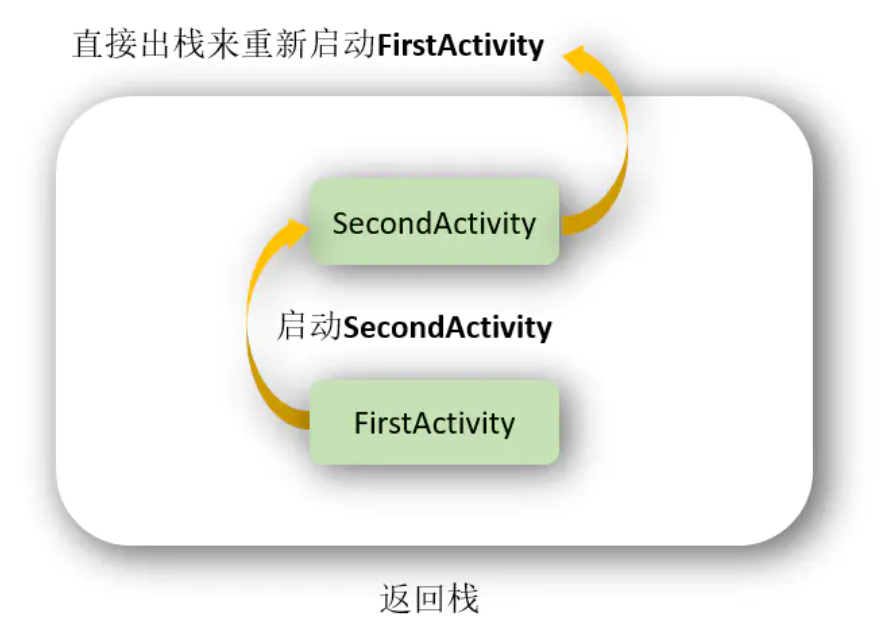

修改AndroidManifest.xml中的MainActivity的启动模式`android:launchMode="singleTask"`

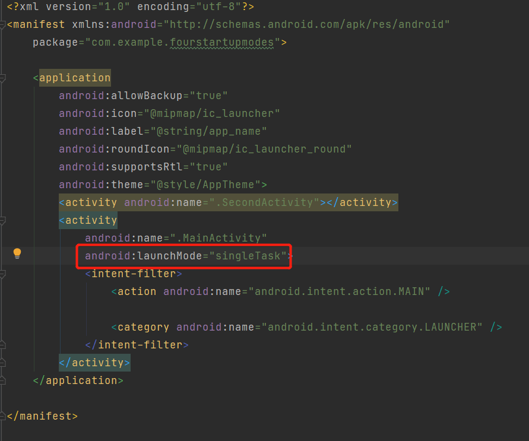

然后在MainActivity中添加onRestart()方法，并打印日志：

```java
String TAG = "FirstActivity";
@Override
protected void onRestart() {
  super.onRestart();
  Log.d(TAG, "onRestart: ");
}
```

在SecondActivity中添加onDestroy()方法，并打印日志：

```java
String TAG = "SecondActivity";
@Override
protected void onDestroy() {
  super.onDestroy();
  Log.d(TAG, "onDestroy: ");
}
```

**日志：**

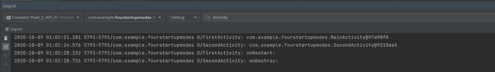

MainActivity中启动 SecondActivity时，会在栈上创建SecondActivity实例，此时SecondActivity在栈顶，MainActivity在下面。当在SecondActivity中启动MainActivity时，会发现返回栈中已经存在一个MainActivity的实例，并且在SecondActivity的下面，于是SecondActivity会从返回栈中出栈，而 MainActivity重新成为了栈顶活动，因此 MainActivity的 onRestart()方法和 SecondActivity的 onDestroy()方法会得到执行。现在返回栈中应该只剩下一个 MainActivity的实例了，按一下Back键就可以退出程序。


------


## singleInstance

singleInstance模式算是4种启动模式中最复杂的一个了，不同于以上三种模式，该模式下活动会启用一个新的返回栈来管理这个活动(其实如果singleTask模式指定了不同的taskAffinity，也会启动一个新的返回栈)。

那么这样做有什么意义呢?想象以下场景，假设我们的程序中有一个活动是允许其他程序调用的，如果我们想实现其他程序和我们的程序可以共享这个活动的实例，应该如何实现呢?使用前面3种启动模式肯定是做不到的，因为每个应用程序都会有自己的返回栈，同一个活动在不同的返回栈中入栈时必然是创建了新的实例。而使用singlelnstance模式就可以解决这个问题，在这种模式下会有一个单独的返回栈来管理这个活动，不管是哪个应用程序来访问这个活动，都共用的同一个返回栈，也就解决了共享活动实例的问题。

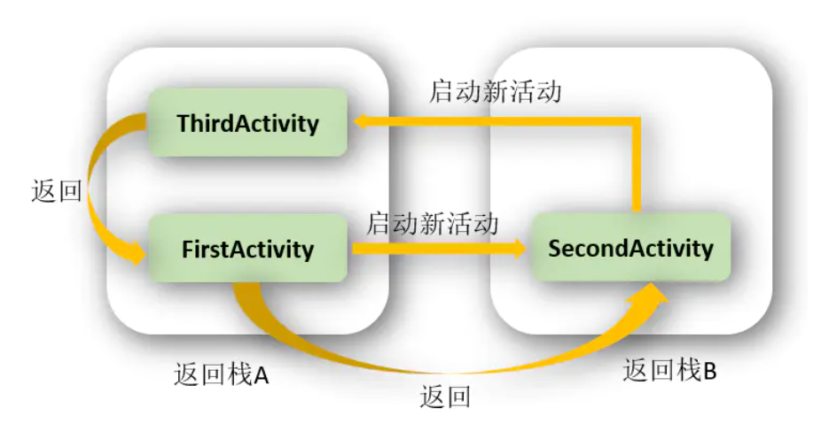

首先创建一个新活动ThirdActivity及布局activity_third，在onCreate方法中写`Log.d("ThirdActivity","Task id is "+getTaskId());`用于打印当前返回栈的id

```java
public class ThirdActivity extends AppCompatActivity {

  @Override
  protected void onCreate(Bundle savedInstanceState) {
    super.onCreate(savedInstanceState);
    setContentView(R.layout.activity_third);
    Log.d("ThirdActivity", "Task id is "+getTaskId());
  }
}
```

修改MainActivity中onCreate()打印日志代码为`Log.d("MainActivity","Task id is "+getTaskId());`

```java
public class MainActivity extends AppCompatActivity {

  String TAG = "FirstActivity";

  @Override
  protected void onCreate(Bundle savedInstanceState) {
    super.onCreate(savedInstanceState);
    setContentView(R.layout.activity_main);
    Log.d(TAG, "Task id is "+getTaskId());
    Button button1 = (Button) findViewById(R.id.button1);
    button1.setOnClickListener(view -> {
      Intent intent = new Intent(MainActivity.this, SecondActivity.class);
      startActivity(intent);
    });
  }

  @Override
  protected void onRestart() {
    super.onRestart();
    Log.d(TAG, "onRestart: ");
  }
}
```

SecondActivity中同样修改这句代码，并使按钮响应事件改为跳转至ThirdActivity

```java
public class SecondActivity extends AppCompatActivity {

  String TAG = "SecondActivity";

  @Override
  protected void onCreate(Bundle savedInstanceState) {
    super.onCreate(savedInstanceState);
    setContentView(R.layout.activity_second);
    Log.d(TAG, "Task id is "+getTaskId());
    Button button2 = (Button) findViewById(R.id.button2);
    button2.setOnClickListener(view -> {
      Intent intent = new Intent(SecondActivity.this, ThirdActivity.class);
      startActivity(intent);
    });
  }

  @Override
  protected void onDestroy() {
    super.onDestroy();
    Log.d(TAG, "onDestroy: ");
  }
}
```

**日志：**

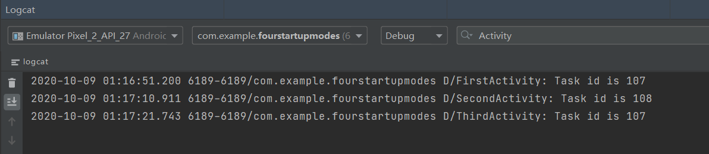

可以看到， SecondActivity的Task id不同于MainActivity和ThirdActivity，这说明SecondActivity确实是存放在一个单独的返回栈里的，而且这个栈中只有SecondActivity这一个活动。