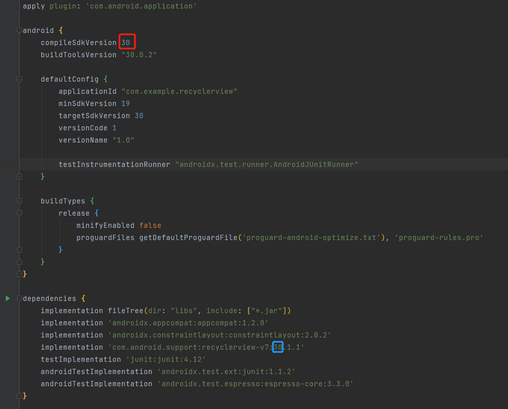

# RecycleView

[RecyclerView](https://links.jianshu.com/go?to=https%3A%2F%2Fdeveloper.android.com%2Freference%2Fandroid%2Fsupport%2Fv7%2Fwidget%2FRecyclerView)是Android一个更强大的控件,其不仅可以实现和ListView同样的效果,还有优化了ListView中的各种不足。其可以实现数据纵向滚动,也可以实现横向滚动(ListView做不到横向滚动)。接下来讲解RecyclerView的用法。

## RecyclerView 基本用法

因为`RecyclerView`属于新增的控件,Android将RecyclerView定义在support库里。若要使用RecyclerView,第一步是要在`build.gradle`中添加对应的依赖库。


### 添加RecyclerView 依赖库

> ~~书籍《Android-第一行代码 第2版》用`complie`添加RecyclerView依赖的方法是过时的~~
>
> ```groovy
> // 不推荐
> complie 'com.android.support:recycleview-v7:24.2.1'
> ```


**新版用一下方法**

在`app/build.gradle`中的`dependencies闭包`添加以下内容：

```groovy
 implementation 'com.android.support:recyclerview-v7:30.1.1'
```

注意事项：

这里版本要一致，不然会报错



然后点击顶部的Sync Now进行同步

### 修改 activity_main.xml

> ~~然后旧版修改 activity_main.xml这样的，也是过时的~~
>
> ```xml
> <LinearLayout xmlns:android="http://schemas.android.com/apk/res/android"
>               xmlns:app="http://schemas.android.com/apk/res-auto"
>               xmlns:tools="http://schemas.android.com/tools"
>               android:layout_width="match_parent"
>               android:layout_height="match_parent"
>               >
> 
>   <android.support.v7.widget.RecyclerView
>                                           android:id="@+id/recycler_view"
>                                           android:layout_width="match_parent"
>                                           android:layout_height="match_parent"
>                                           />
> </LinearLayout>
> ```
>
> **`android.support.v7.widget.RecyclerView`写这个会报错，找不着这个类**

应该写成这个类`androidx.recyclerview.widget.RecyclerView`

```xml
<LinearLayout xmlns:android="http://schemas.android.com/apk/res/android"
              xmlns:app="http://schemas.android.com/apk/res-auto"
              xmlns:tools="http://schemas.android.com/tools"
              android:layout_width="match_parent"
              android:layout_height="match_parent"
              >

  <androidx.recyclerview.widget.RecyclerView
                                             android:id="@+id/recycler_view"
                                             android:layout_width="match_parent"
                                             android:layout_height="match_parent"
                                             />
</LinearLayout>
```

### 新建 Fruit.java

```java
public class Fruit {

  private String name;
  private int imageId;

  public Fruit(String name, int imageId){
    this.name = name;
    this.imageId = imageId;

  }

  public String getName() {
    return name;
  }

  public int getImageId() {
    return imageId;
  }
}
```

### 新建 fruit_item.xml

```xml
<?xml version="1.0" encoding="utf-8"?>
<LinearLayout
              xmlns:android="http://schemas.android.com/apk/res/android"
              android:layout_width="match_parent"
              android:layout_height="wrap_content"

              >
  <ImageView
             android:layout_width="wrap_content"
             android:layout_height="wrap_content"
             android:id="@+id/fruit_image"/>

  <TextView
            android:layout_width="wrap_content"
            android:layout_height="wrap_content"
            android:id="@+id/fruitname"
            android:layout_gravity="center_vertical"
            android:layout_marginLeft="10dp"/>

</LinearLayout>
```

### 新增适配器 FruitAdapter

为`RecyclerView`新增适配器`FruitAdapter`,并让其继承于`RecyclerView.Adapter`,把泛型指定为`FruitAdapter.ViewHolder`。

```java
public class FruitAdapter extends RecyclerView.Adapter<FruitAdapter.ViewHolder> {

  private List<Fruit> mFruitList;

  static class ViewHolder extends RecyclerView.ViewHolder {
    ImageView fruitImage;
    TextView fruitName;

    public ViewHolder(View view) {
      super(view);
      fruitImage = (ImageView) view.findViewById(R.id.fruit_image);
      fruitName = (TextView) view.findViewById(R.id.fruitname);
    }

  }

  public FruitAdapter(List<Fruit> fruitList) {
    mFruitList = fruitList;
  }

  @Override

  public ViewHolder onCreateViewHolder(ViewGroup parent, int viewType) {
    View view = LayoutInflater.from(parent.getContext()).inflate(R.layout.fruit_item, parent, false);
    ViewHolder holder = new ViewHolder(view);
    return holder;
  }

  @Override
  public void onBindViewHolder(ViewHolder holder, int position) {

    Fruit fruit = mFruitList.get(position);
    holder.fruitImage.setImageResource(fruit.getImageId());
    holder.fruitName.setText(fruit.getName());
  }

  @Override
  public int getItemCount() {
    return mFruitList.size();
  }
}
```

* 定义内部类`ViewHolder`,并继承`RecyclerView.ViewHolder`。传入的View参数通常是RecyclerView子项的最外层布局。

* FruitAdapter构造函数,用于把要展示的数据源传入,并赋予值给全局变量mFruitList。

* FruitAdapter继承RecyclerView.Adapter。因为必须重写`onCreateViewHolder()`,`onBindViewHolder()`和`getItemCount()`三个方法

- `onCreateViewHolder()`用于创建ViewHolder实例,并把加载的布局传入到构造函数去,再把ViewHolder实例返回。
- `onBindViewHolder()`则是用于对子项的数据进行赋值,会在每个子项被滚动到屏幕内时执行。`position`得到当前项的Fruit实例。
- `getItemCount()`返回RecyclerView的子项数目。

### 加入图片


### 修改 MainActivity.java

```java
public class MainActivity extends AppCompatActivity {

  private List<Fruit> fruitList = new ArrayList<>();

  @Override
  protected void onCreate(Bundle savedInstanceState) {
    super.onCreate(savedInstanceState);
    setContentView(R.layout.activity_main);
    initFruits();
    RecyclerView recyclerView = (RecyclerView) findViewById(R.id.recycler_view);
    LinearLayoutManager layoutManager = new LinearLayoutManager(this);
    recyclerView.setLayoutManager(layoutManager);
    FruitAdapter adapter = new FruitAdapter(fruitList);
    recyclerView.setAdapter(adapter);
  }

  private void initFruits() {
    for (int i = 0; i < 2; i++) {
      Fruit apple = new Fruit("Apple", R.drawable.apple_pic);
      fruitList.add(apple);
      Fruit banana = new Fruit("Banana", R.drawable.banana_pic);
      fruitList.add(banana);
      Fruit orange = new Fruit("Orange", R.drawable.orange_pic);
      fruitList.add(orange);
      Fruit watermelon = new Fruit("Watermelon", R.drawable.watermelon_pic);
      fruitList.add(watermelon);
      Fruit pear = new Fruit("Pear", R.drawable.pear_pic);
      fruitList.add(pear);
      Fruit grape = new Fruit("Grape", R.drawable.grape_pic);
      fruitList.add(grape);
      Fruit pineapple = new Fruit("Pineapple", R.drawable.pineapple_pic);
      fruitList.add(pineapple);
      Fruit strawberry = new Fruit("Strawberry", R.drawable.strawberry_pic);
      fruitList.add(strawberry);
      Fruit cherry = new Fruit("Cherry", R.drawable.cherry_pic);
      fruitList.add(cherry);
      Fruit mango = new Fruit("Mango", R.drawable.mango_pic);
      fruitList.add(mango);

    }
  }
}
```

### 运行结果


------


## 横向滚动

### 修改 fruit_item.xml

```xml
<?xml version="1.0" encoding="utf-8"?>
<LinearLayout
              xmlns:android="http://schemas.android.com/apk/res/android"
              android:layout_width="100dp"
              android:layout_height="wrap_content"
              android:orientation="vertical"

              >
  <ImageView
             android:layout_width="wrap_content"
             android:layout_height="wrap_content"
             android:id="@+id/fruit_image"
             android:layout_gravity="center_horizontal"/>

  <TextView
            android:layout_width="wrap_content"
            android:layout_height="wrap_content"
            android:id="@+id/fruitname"
            android:layout_gravity="center_horizontal"
            android:layout_marginTop="10dp"/>
</LinearLayout>
```

把LinearLayout改成垂直排列,因为水果名字长度不一样,把宽度改为100dp。
ImageView和TextView都改为水平居中

### 修改MainActivity.java

```java
@Override
protected void onCreate(Bundle savedInstanceState) {
  super.onCreate(savedInstanceState);
  setContentView(R.layout.activity_main);
  initFruits();
  RecyclerView recyclerView = (RecyclerView) findViewById(R.id.recycler_view);
  LinearLayoutManager layoutManager = new LinearLayoutManager(this);
  layoutManager.setOrientation(LinearLayoutManager.HORIZONTAL);
  recyclerView.setLayoutManager(layoutManager);
  FruitAdapter adapter = new FruitAdapter(fruitList);
  recyclerView.setAdapter(adapter);
}
```

通过调用`setOrientation()`把布局的排列方向改为水平排列。

### 运行结果


------


## 瀑布流布局

StaggeredGridLayoutManager(瀑布流布局)

### 修改fruit_item.xml

把LinearLayout的宽度设为`match_parent`是因为瀑布流的宽度是 **根据布局的列数来自动适配的,而不是固定值** 。

```xml
<?xml version="1.0" encoding="utf-8"?>
<LinearLayout
              xmlns:android="http://schemas.android.com/apk/res/android"
              android:layout_width="match_parent"
              android:layout_height="wrap_content"
              android:layout_margin="5dp"

              >
  <ImageView
             android:layout_width="wrap_content"
             android:layout_height="wrap_content"
             android:id="@+id/fruit_image"
             android:layout_gravity="center_horizontal"/>

  <TextView
            android:layout_width="wrap_content"
            android:layout_height="wrap_content"
            android:id="@+id/fruitname"
            android:layout_gravity="left"
            android:layout_marginTop="10dp"/>

</LinearLayout>
```

### 修改 MainActivity.java

```java
public class MainActivity extends AppCompatActivity {

  private List<Fruit> fruitList = new ArrayList<>();

  @Override
  protected void onCreate(Bundle savedInstanceState) {
    super.onCreate(savedInstanceState);
    setContentView(R.layout.activity_main);
    initFruits();
    RecyclerView recyclerView = (RecyclerView) findViewById(R.id.recycler_view);
    StaggeredGridLayoutManager layoutManager = new StaggeredGridLayoutManager(3,StaggeredGridLayoutManager.VERTICAL);
    recyclerView.setLayoutManager(layoutManager);
    FruitAdapter adapter = new FruitAdapter(fruitList);
    recyclerView.setAdapter(adapter);
  }
  private void initFruits() {
    for (int i = 0; i < 2; i++) {
      Fruit apple = new Fruit(getRandomLengthName("Apple"), R.drawable.apple_pic);
      fruitList.add(apple);
      Fruit banana = new Fruit(getRandomLengthName("Banana"), R.drawable.banana_pic);
      fruitList.add(banana);
      Fruit orange = new Fruit(getRandomLengthName("Orange"), R.drawable.orange_pic);
      fruitList.add(orange);
      Fruit watermelon = new Fruit(getRandomLengthName("Watermelon"), R.drawable.watermelon_pic);
      fruitList.add(watermelon);
      Fruit pear = new Fruit(getRandomLengthName("Pear"), R.drawable.pear_pic);
      fruitList.add(pear);
      Fruit grape = new Fruit(getRandomLengthName("Grape"), R.drawable.grape_pic);
      fruitList.add(grape);
      Fruit pineapple = new Fruit(getRandomLengthName("Pineapple"), R.drawable.pineapple_pic);
      fruitList.add(pineapple);
      Fruit strawberry = new Fruit(getRandomLengthName("Strawberry"), R.drawable.strawberry_pic);
      fruitList.add(strawberry);
      Fruit cherry = new Fruit(getRandomLengthName("Cherry"), R.drawable.cherry_pic);
      fruitList.add(cherry);
      Fruit mango = new Fruit(getRandomLengthName("Mango"), R.drawable.mango_pic);
      fruitList.add(mango);
    }
  }
  private String getRandomLengthName(String name){
    Random random = new Random();
    int length= random.nextInt(20)+1;  // 产生1-20的随机数
    StringBuilder builder = new StringBuilder();
    for (int i =0;i<length;i++){
      builder.append(name);
    }
    return  builder.toString();
  }
}
```

`StaggeredGridLayoutManager layoutManager = new StaggeredGridLayoutManager(3,StaggeredGridLayoutManager.VERTICAL);`
 StaggeredGridLayoutManager传入2个参数,第一个是布局的列数,第二个是布局的排列方向。

`random.nextInt(20)+1` 产生1-20的随机数

### 运行结果


------


## RecyclerView 的点击事件

### 修改 FruitAdapter.java

```java
public class FruitAdapter extends RecyclerView.Adapter<FruitAdapter.ViewHolder> {

  private  List<Fruit> mFruitList;
  static class ViewHolder extends RecyclerView.ViewHolder{
    View fruitView;
    ImageView fruitImage;
    TextView fruitName;

    public ViewHolder (View view)
    {
      super(view);
      fruitView = view;
      fruitImage = (ImageView) view.findViewById(R.id.fruit_image);
      fruitName = (TextView) view.findViewById(R.id.fruitname);
    }

  }

  public  FruitAdapter (List <Fruit> fruitList){
    mFruitList = fruitList;
  }

  @Override

  public ViewHolder onCreateViewHolder(ViewGroup parent, int viewType){
    View view = LayoutInflater.from(parent.getContext()).inflate(R.layout.fruit_item,parent,false);
    final ViewHolder holder = new ViewHolder(view);
    holder.fruitView.setOnClickListener(new View.OnClickListener() {
      @Override
      public void onClick(View view) {
        int position = holder.getAdapterPosition();
        Fruit fruit = mFruitList.get(position);
        Toast.makeText(view.getContext(), "you clicked view" + fruit.getName(), Toast.LENGTH_SHORT).show();
      }
    });

    holder.fruitImage.setOnClickListener(new View.OnClickListener() {
      @Override
      public void onClick(View view) {
        int position = holder.getAdapterPosition();
        Fruit fruit = mFruitList.get(position);
        Toast.makeText(view.getContext(), "you clicked image" + fruit.getName(), Toast.LENGTH_SHORT).show();
      }
    });
    return holder;
  }

  ...
}
```

### 运行结果

**点击苹果图片：**


**点击苹果文字：**


## RecyclerView的拓展作业

点击图片或文字，弹出文本框形式的对话框，在对话框中输入文字，修改图片的文字描述

### 修改FruitAdapter.java

```java
public  FruitAdapter (List <Fruit> fruitList, MainActivity mainActivity){
  this.mainActivity = mainActivity;
  mFruitList = fruitList;
}

@Override
public ViewHolder onCreateViewHolder(ViewGroup parent, int viewType){
  View view = LayoutInflater.from(parent.getContext()).inflate(R.layout.fruit_item,parent,false);
  final ViewHolder holder = new ViewHolder(view);
  holder.fruitView.setOnClickListener(new View.OnClickListener() {
    @Override
    public void onClick(final View view) {
      alert_edit(holder, view);
    }
  });

  holder.fruitImage.setOnClickListener(new View.OnClickListener() {
    @Override
    public void onClick(final View view) {
      alert_edit(holder, view);
    }
  });
  return holder;
}

public void alert_edit(final ViewHolder holder,final View view){
  //首先添加一个edit实例，然后通过dialog设置显示
  final EditText editText = new EditText(mainActivity);
  AlertDialog.Builder dialog = new AlertDialog.Builder(mainActivity);
  dialog.setTitle("修改图片文字");
  dialog.setView(editText);
  dialog.setCancelable(false);
  dialog.setPositiveButton("确定", new DialogInterface.OnClickListener() {
    @Override
    public void onClick(DialogInterface dialog, int which) {
      int position = holder.getAdapterPosition();
      Fruit fruit = mFruitList.get(position);
      fruit.setName(editText.getText().toString());
      Toast.makeText(view.getContext(), "修改成功" + fruit.getName(), Toast.LENGTH_SHORT).show();
      notifyItemChanged(position);
    }
  });
  dialog.setNegativeButton("取消", new DialogInterface.OnClickListener() {
    @Override
    public void onClick(DialogInterface dialog, int which) {

    }
  });
  dialog.show();
}
```

修改图片和文字的点击事件，这里调用了`alert_edit`方法

然后`EditText`的构造函数和`AlertDialog.Builder`方法需要Activity实例，所以修改了`FruitAdapter.java`的构造函数，多了一个`MainActivity mainActivity`参数

### MainActivity.java

```java
FruitAdapter adapter = new FruitAdapter(fruitList, MainActivity.this);
```

根据上文所示修改了`FruitAdapter.java`的构造函数，所以传入`MainActivity.this`

### 运行结果

**未修改前：**


**点击修改时：**


**点击修改后：**

