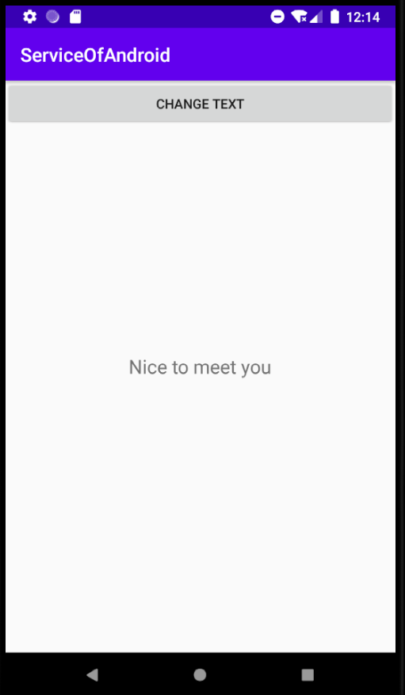
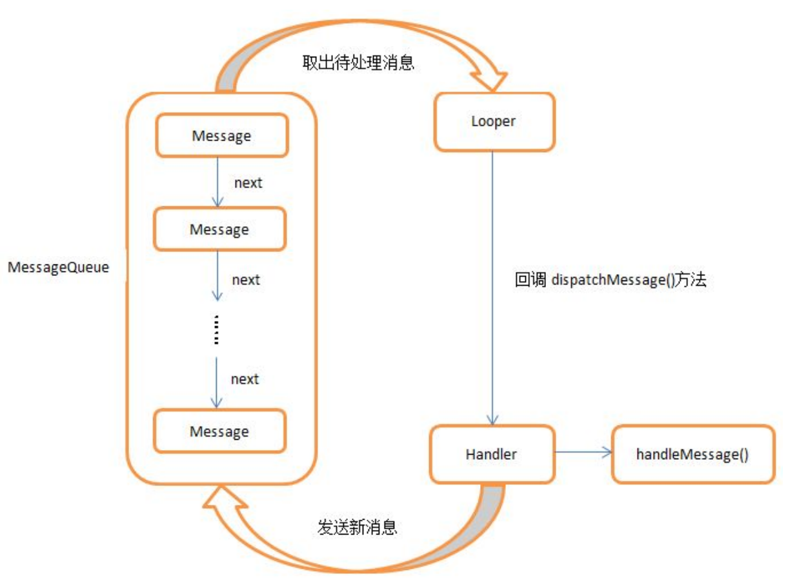
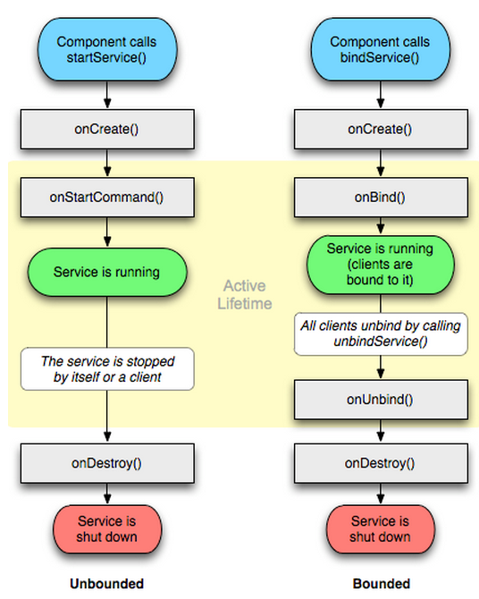
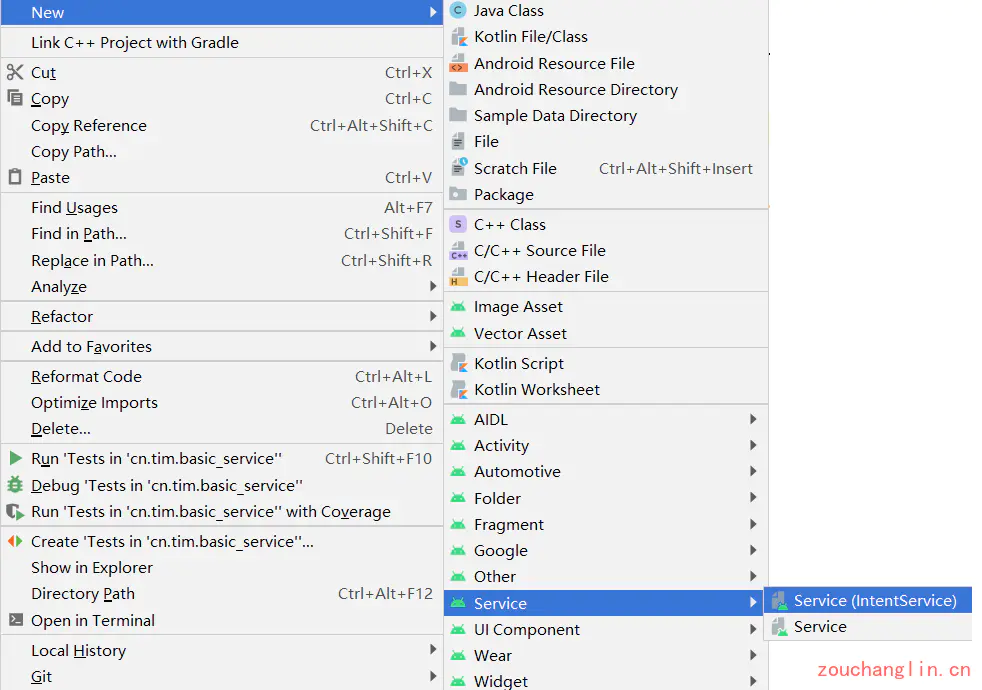

# 安卓的服务

## 服务

- 服务(Service)是Android中实现程序后台运行的解决方案，它非常适合去执行那些不需要和用户交互而且还要求长期运行的任务。
- 服务依赖于创建服务时所在的应用程序进程。


------


## Android多线程

### 线程的基本用法

- 继承Thread

```java
class MyThread extends Thread{

    @Override
    public void run(){
        //处理具体逻辑
    }
}1234567
```

- 实现Runable接口

```java
class MyThread implements Runnable{

    @Override
    public void run(){
        //实现具体逻辑
    }
}1234567
```

- 匿名内部类形式

```java
new Thread(new Runnable(){

    @Override
    public void run(){
        //实现具体逻辑
    }
}).start();
```


### 在子线程中更新UI

- Android的UI是线程不安全的，如果想要更新应用程序里的UI元素，则必须在主线程中进行，否则就会出现异常。
- 可使用Android中的异步处理机制

> ~~安卓不允许在子线程中进行UI操作~~
>
> ```java
> @Override
> protected void onCreate(Bundle savedInstanceState) {
>   super.onCreate(savedInstanceState);
>   setContentView(R.layout.activity_main);
>   text = findViewById(R.id.text);
>   Button changeText = (Button) findViewById(R.id.change_text);
>   changeText.setOnClickListener(new View.OnClickListener() {
>      @Override
>      public void onClick(View view) {
>        switch (view.getId()) {
>          case R.id.change_text:
>            new Thread(new Runnable() {
>              @Override
>              public void run() {
>                text.setText("Nice to meet you");
>              }
>            }).start();
>            break;
>          default:
>            break;
>        }
>    }
> });
> 
> ```
> ```
> Only the original thread that created a view hierarchy can touch its views.
> ```

虽然不允许在子线程中更新UI，但是Android提供了一套异步消息处理机制，完美解决了在子线程中操作UI的问题，那就是使用Handler。

```java
public class MainActivity extends AppCompatActivity {

    public static final int UPDATE_TEXT = 1;

    private TextView text;

    @Override
    protected void onCreate(Bundle savedInstanceState) {
        super.onCreate(savedInstanceState);
        setContentView(R.layout.activity_main);
        text = findViewById(R.id.text);
        Button changeText = (Button) findViewById(R.id.change_text);
        changeText.setOnClickListener(new View.OnClickListener() {
            @Override
            public void onClick(View view) {
                switch (view.getId()) {
                    case R.id.change_text:
                        new Thread(new Runnable() {
                            @Override
                            public void run() {
                                // 安卓不允许在子线程中进行UI操作
                                // text.setText("Nice to meet you");
                                Message message = new Message();
                                message.what = UPDATE_TEXT;
                                handler.sendMessage(message);
                            }
                        }).start();
                        break;
                    default:
                        break;
                }
            }
        });
    }

    private Handler handler = new Handler(Looper.myLooper()) {
        @Override
        public void handleMessage(@NonNull Message msg) {
            switch (msg.what) {
                case UPDATE_TEXT:
                   text.setText("Nice to meet you");
                   break;
                default:
                    break;
            }
        }
    };

}
```




### 解析异步消息处理机制

Android中的异步消息处理机制主要由四个部分组成，Message、Handler、MessageQueue和Looper。

- Message是在线程之间传递的消息，它可以在内部携带少量的信息用于不同线程间交换数据
- Handler 顾名思义也就是处理者的意思，它主要是用于发送和处理消息的。
- MessageQueue 是消息队列的意思，它主要用于存放所有通过 Handler 发送的消息。
- Looper 是每个线程中的 MessageQueue 的管家，调用 Looper 的 loop()方法后，就会进入到一个无限循环当中，然后每当发现 MessageQueue 中存在一条消息，就会将它取出， 并传递到 Handler 的 handleMessage()方法中。 每个线程中也只会有一个 Looper 对象。
  


### 使用AsyncTask

- AsyncTask将异步消息处理机制进行了封装
- AsyncTask是一个抽象类，需要用子类继承它，在继承时可以为AnyncTask指定三个泛型参数
  - Params：在执行AsyncTask时需要传入的参数，可以于在后台任务中使用
  - Progress：后台任务执行时，如果需要在界面上显示当前的进度，则使用这里指定的泛型作为进度单位。
  - Result：当任务执行完毕后，如果需要对结果进行返回，则使用这里指定的泛型作为返回值类型。

```java
class DownloadTask extends AsyncTask<Void,Integer,Boolean>{
    ......
}
```

- 还需重写AsyncTask中的方法
  * onPreExecute()：这个方法会在后台任务开始执行之前调用，用于进行一些界面上的初始化操作
  * doInBackground(Params…)：这个方法中的所有代码都会在子线程中运行，我们应该在这里去处理所有的耗时任务。任务一旦完成就可以通过 return 语句来将任务的执行结果返回，**在此方法中不能进行UI操作**
  * onProgressUpdate(Progress…)：当在后台任务中调用了publishProgress(Progress…)方法后，这个方法就会很快被调用，方法中携带的参数就是在后台任务中传递过来的。在这个方法中可以对 UI 进行操作，利用参数中的数值就可以对界面元素进行相应地更新
  * onPostExecute(Result)：当后台任务执行完毕并通过 return 语句进行返回时，这个方法就很快会被调用。返回的数据会作为参数传递到此方法中，可以利用返回的数据来进行一些 UI 操作

```java
public class DownloadTask extends AsyncTask<Void, Integer, Boolean> {

    /**
     * 这个方法会在后台任务开始执行之前调用，用于进行一些界面上的初始化操作
     */
    @Override
    protected void onPreExecute() {
    }

    /**
     * 当后台任务执行完毕并通过 return 语句进行返回时，这个方法就很快会被调用。
     * 返回的数据会作为参数传递到此方法中，可以利用返回的数据来进行一些 UI 操作
     * @param aBoolean
     */
    @Override
    protected void onPostExecute(Boolean aBoolean) {
        super.onPostExecute(aBoolean);
    }

    /**
     * 当在后台任务中调用了publishProgress(Progress…)方法后，这个方法就会很快被调用，
     * 方法中携带的参数就是在后台任务中传递过来的。在这个方法中可以对 UI 进行操作，
     * 利用参数中的数值就可以对界面元素进行相应地更新
     * @param values
     */
    @Override
    protected void onProgressUpdate(Integer... values) {
        super.onProgressUpdate(values);
    }

    /**
     * 这个方法中的所有代码都会在子线程中运行，我们应该在这里去处理所有的耗时任务。
     * 任务一旦完成就可以通过 return 语句来将任务的执行结果返回，在此方法中不能进行UI操作
     * @param voids
     * @return
     */
    @Override
    protected Boolean doInBackground(Void... voids) {

        // 抛出任务执行的进度给 onProgressUpdate(Integer... values)方法
        publishProgress(1);
        return null;
    }
}
```

如果要启动这个任务：

```java
new DownloadTask().execute(Params params);
```


------


## 服务的基本用法

服务首先作为Android四大组件之一，自然也要在Manifest文件中声明，这是Android四大组件共有的特点。新建一个MyService类继承自Service，然后再清单文件中声明即可。

### 定义一个服务

- 继承Service类

```java
public class MyService extends Service {
    public MyService() {
    }

    @Override
    public IBinder onBind(Intent intent) {
        // TODO: Return the communication channel to the service.
        throw new UnsupportedOperationException("Not yet implemented");
    }

    @Override
    public void onCreate() {
        super.onCreate();
    }

    @Override
    public int onStartCommand(Intent intent, int flags, int startId) {
        return super.onStartCommand(intent, flags, startId);
    }

    @Override
    public void onDestroy() {
        super.onDestroy();
    }
}
```

> 重写Service中最常用的三个方法
>
> - onCreate()：在服务创建时调用
> - onStartCommand()：在服务启动时调用
> - onDestroy()：在服务销毁时调用

- 在AndroidManifest.xml文件中注册服务

```xml
<service
    android:name=".MyService"
    android:enabled="true"
    android:exported="true">
</service>
```


### 启动和停止服务

- 启动服务

```
Intent startIntent = new Intent(this,MyService.class);
startService(startIntent);12
```

- 停止服务

```
Intent stopIntent = new Intent(this,MyService.class);
stopService(stopIntent);12
```

- onCreate()和onStartCommand()的区别： 
  - onCreate()方法是在服务第一次创建的时候调用的
  - onStartCommand()方法则在每次启动服务的时候都会调用。


### 活动和服务进行通信

- 思路：专门创建一个Binder对象对下载功能进行管理

```java
public class MyService extends Service {
    public MyService() {
    }

    private DownloadBinder mBinder = new DownloadBinder();

    class DownloadBinder extends Binder {
        public void startDownload(){
            Log.d("MyService","startDownload executed");
        }

        public int getProgress() {
            Log.d("MyService", "getProgress executed");
            return 0;
        }
    }

    @Override
    public IBinder onBind(Intent intent) {
        return mBinder;
    }

    @Override
    public void onCreate() {
        super.onCreate();
        Log.d("MyService", "onCreate executed");
    }

    @Override
    public int onStartCommand(Intent intent, int flags, int startId) {
        Log.d("MyService", "onStartCommand executed");
        return super.onStartCommand(intent, flags, startId);
    }

    @Override
    public void onDestroy() {
        super.onDestroy();
        Log.d("MyService", "onDestroy executed");
    }
}
```

```java
public class MyMainActivity extends AppCompatActivity implements View.OnClickListener {

    private Button startService;
    private Button stopService;
    private Button bindService;
    private Button unbindService;
    private MyService.DownloadBinder downloadBinder;
    private ServiceConnection connection = new ServiceConnection(){
        @Override
        public void onServiceDisconnected(ComponentName name) {
        }
        @Override
        public void onServiceConnected(ComponentName name, IBinder service) {
            downloadBinder = (MyService.DownloadBinder) service;
            downloadBinder.startDownload();
            downloadBinder.getProgress();
        }
    };

    @Override
    protected void onCreate(Bundle savedInstanceState) {
        super.onCreate(savedInstanceState);
        setContentView(R.layout.activity_main);
        startService = (Button) findViewById(R.id.start_service);
        stopService = (Button) findViewById(R.id.stop_service);
        bindService = (Button) findViewById(R.id.bind_service);
        unbindService = (Button) findViewById(R.id.unbind_service);
        startService.setOnClickListener(this);
        stopService.setOnClickListener(this);
        bindService.setOnClickListener(this);
        unbindService.setOnClickListener(this);
    }

    @Override
    public void onClick(View v) {
        switch (v.getId()) {
            case R.id.start_service:
                Intent startIntent = new Intent(this, MyService.class);
                startService(startIntent);
                break;
            case R.id.stop_service:
                Intent stopIntent = new Intent(this, MyService.class);
                stopService(stopIntent);
                break;
            case R.id.bind_service:
                Intent bindIntent = new Intent(this, MyService.class);
                // 绑定服务
                bindService(bindIntent, connection, BIND_AUTO_CREATE);
                break;
            case R.id.unbind_service:
                // 解绑服务
                unbindService(connection);
                break;
            default:
                break;
        }
    }
}
```


### 服务的生命周期



一旦调用了startServices()方法，对应的服务就会被启动且回调onStartCommand()，如果服务未被创建，则会调用onCreate()创建Service对象。服务被启动后会一直保持运行状态，直到stopService()或者stopSelf()方法被调用。不管startService()被调用了多少次，但是只要Service对象存在，onCreate()方法就不会被执行，所以只需要调用一次stopService()或者stopSelf()方法就会停止对应的服务。

在通过bindService()来获取一个服务的持久连接的时候，这时就会回调服务中的 onBind()方法。类似地，如果这个服务之前还没有创建过，oncreate()方法会先于onBind()方法执行。之后，调用方可以获取到onBind()方法里返回的IBinder对象的实例，这样就能自由地和服务进行通信了。只要调用方和服务之间的连接没有断开，服务就会一直保持运行状态。

那么即调用了startService()又调用了bindService()方法的，这种情况下该如何才能让服务销毁掉呢？根据Android系统的机制，一个服务只要被启动或者被绑定了之后，就会一直处于运行状态，必须要让以上两种条件同时不满足，服务才能被销毁。所以，这种情况下要同时调用stopService()和 unbindService()方法，onDestroy()方法才会执行。


------


## 服务的更多技巧

上面讲述了服务最基本的用法，下面来看看关于服务的更高级的技巧。

### 使用前台服务

服务几乎都是在后台运行的，服务的系统优先级还是比较低的，当系统出现内存不足的情况时，就有可能会回收掉正在后台运行的服务。如果你希望服务可以一直保持运行状态，而不会由于系统内存不足的原因导致被回收，就可以使用前台服务。比如QQ电话的悬浮窗口，或者是某些天气应用需要在状态栏显示天气。

```java
public class FrontService extends Service {
    String mChannelId = "1001";

    public FrontService() {
    }

    @Override
    public IBinder onBind(Intent intent) {
        // TODO: Return the communication channel to the service.
        throw new UnsupportedOperationException("Not yet implemented");
    }

    @Override
    public void onCreate() {
        super.onCreate();
        Intent intent = new Intent(this, MainActivity.class);
        PendingIntent pi = PendingIntent.getActivity(this, 0, intent, 0);
        Notification notification = new NotificationCompat.Builder(this, mChannelId)
                .setContentTitle("This is content title.")
                .setContentText("This is content text.")
                .setWhen(System.currentTimeMillis())
                .setSmallIcon(R.mipmap.ic_launcher)
                .setLargeIcon(BitmapFactory.decodeResource(getResources(),
                        R.mipmap.ic_launcher))
                .setContentIntent(pi)
                .build();
        startForeground(1, notification);
    }
}
```


### 使用IntentService

服务中的代码都是默认运行在主线程当中的，如果直接在服务里去处理一些耗时的逻辑，就很容易出现ANR的情况。所以需要用到多线程编程，遇到耗时操作可以在服务的每个具体的方法里开启一个子线程，然后在这里去处理那些耗时的逻辑。就可以写成如下形式：

```java
public class OtherService extends Service {
    public OtherService() {}

    @Override
    public int onStartCommand(Intent intent, int flags, int startId) {
        new Thread(()->{
            // TODO 执行耗时操作
        }).start();
        return super.onStartCommand(intent, flags, startId);
    }
    ...
}
```

但是，这种服务一旦启动之后，就会一直处于运行状态，必须调用stopService()或者stopSelf()方法才能让服务停止下来。所以，如果想要实现让一个服务在执行完毕后自动停止的功能，就可以这样写：

```java
public class OtherService extends Service {
    public OtherService() {}

    @Override
    public int onStartCommand(Intent intent, int flags, int startId) {
        new Thread(()->{
            // TODO 执行耗时操作
            stopSelf();
        }).start();
        return super.onStartCommand(intent, flags, startId);
    }
    ...
}
```

虽然这种写法并不复杂，但是总会有一些程序员忘记开启线程，或者忘记调用stopSelf()方法。为了可以简单地创建一个异步的、会自动停止的服务，Android 专门提供了一个IntentService类，这个类就很好地解决了前面所提到的两种尴尬，下面我们就来看一下它的用法：



MyIntentService.java

```java
public class MyIntentService extends IntentService {
  
    public MyIntentService() {
        super("MyIntentService");
    }

    @Override
    protected void onHandleIntent(Intent intent) {
        // 打印当前线程的id
        Log.d("MyIntentService", "Thread id is " + Thread.currentThread().getId());
    }
  
  	@Override
    public void onDestroy() {
        super.onDestroy();
        Log.d("MyIntentService", "onDestroy executed");
    }
}
```

